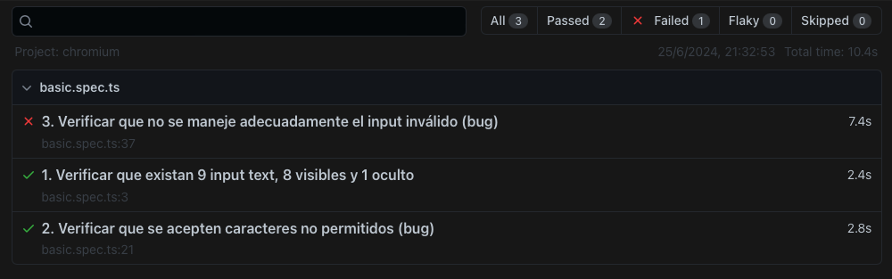

## Pruebas básicas para Buggy Games de Evil Tester


#### instalación de nvm para gestionar node.js
```
curl -o- https://raw.githubusercontent.com/nvm-sh/nvm/v0.39.7/install.sh | bash
```

#### Instalacion de dependencias

```
npm i
```

#### Uso de pruebas
```
npm run test
```

#### Visualización de pruebas realizadas en browser


